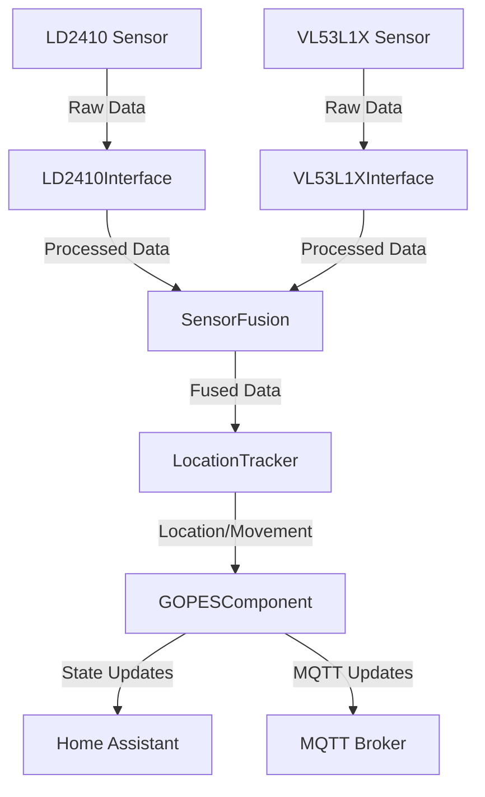

# GOPES Developer Guide

This guide covers the technical details of the GOPES component for developers who want to contribute to or modify the component.

## Development Environment Setup

### Prerequisites

1. Development tools:
```bash
sudo apt-get install build-essential git python3-dev python3-venv
```

2. Create a Python virtual environment:
```bash
python3 -m venv gopes-dev
source gopes-dev/bin/activate
```

3. Install development dependencies:
```bash
pip install esphome
pip install -r requirements-dev.txt
```

### Repository Structure

```
gopes/
├── components/
│   └── gopes/
│       ├── __init__.py           # Component registration
│       ├── binary_sensor.py      # Binary sensor implementation
│       ├── const.py             # Constants
│       ├── config_flow.py       # Configuration handling
│       ├── fusion.py            # Sensor fusion implementation
│       ├── manifest.json        # Component manifest
│       ├── services.yaml        # Service definitions
│       ├── include/
│       │   ├── gopes_utils.h    # Utility functions
│       │   └── gopes_components.h # Core components
│       └── translations/
│           └── en.json          # English translations
├── examples/
│   └── gopes.yaml              # Example configuration
└── tests/
    └── test_gopes.py           # Unit tests
```

## Component Architecture

### Core Classes

1. `GOPESComponent` (gopes_components.h)
   - Main component class
   - Handles sensor integration
   - Manages state and updates

2. `SensorFusion` (fusion.py)
   - Implements sensor fusion algorithms
   - Combines mmWave and ToF data
   - Provides confidence scoring

3. `LocationTracker` (gopes_components.h)
   - Handles position tracking
   - Maintains movement history
   - Provides velocity calculations

### Data Flow



## Development Workflow

### Building the Component

1. Clone the repository:
```bash
git clone https://github.com/AdmiralArgyle/GOPES.git
cd GOPES
```

2. Install development dependencies:
```bash
pip install -e .
```

3. Run tests:
```bash
pytest tests/
```

### Modifying the Component

1. **Sensor Integration**
   - Edit sensor interfaces in `gopes_components.h`
   - Update data processing in `gopes_utils.h`
   - Modify fusion algorithms in `fusion.py`

2. **Configuration**
   - Update schema in `config_flow.py`
   - Add new options to `const.py`
   - Update translations in `en.json`

3. **Home Assistant Integration**
   - Modify service definitions in `services.yaml`
   - Update component registration in `__init__.py`
   - Add new entities in `binary_sensor.py`

### Testing

1. **Unit Tests**
```bash
# Run all tests
pytest

# Run specific test file
pytest tests/test_sensor_fusion.py

# Run with coverage
pytest --cov=gopes
```

2. **Integration Testing**
```bash
# Build test configuration
esphome compile test_gopes.yaml

# Flash test device
esphome upload test_gopes.yaml
```

3. **Manual Testing**
   - Use ESPHome logs for debugging
   - Monitor MQTT topics
   - Verify Home Assistant integration

## Performance Optimization

### Memory Management

1. Use stack allocation where possible:
```cpp
// Prefer this:
std::array<float, 10> buffer;

// Over this:
float* buffer = new float[10];
```

2. Minimize dynamic allocations:
```cpp
// Use reserve for vectors
std::vector<Point2D> history;
history.reserve(100);
```

3. Use circular buffers for history:
```cpp
CircularBuffer<Reading, 10> history_;
```

### CPU Optimization

1. Sensor reading frequency:
```cpp
// Balance update rate with CPU usage
static constexpr uint32_t UPDATE_INTERVAL_MS = 100;
```

2. Fusion algorithm selection:
```cpp
// Choose based on requirements
if (high_precision_required) {
    use_kalman_filter();
} else {
    use_complementary_filter();
}
```

### Memory Usage Guidelines

| Resource          | Target  | Maximum |
|------------------|---------|---------|
| Flash Usage      | <800KB  | 1MB     |
| RAM Usage        | <50KB   | 80KB    |
| Stack Usage      | <4KB    | 8KB     |

## Bluetooth Integration

### LD2410 Configuration

1. Enable bluetooth interface:
```cpp
void LD2410Interface::init_bluetooth() {
    // Initialize BLE
    BLEDevice::init("GOPES_Config");
    // Start advertising
    BLEServer *server = BLEDevice::createServer();
    // Set up services and characteristics
    setup_ble_services(server);
}
```

2. Handle configuration updates:
```cpp
void LD2410Interface::handle_ble_config(const std::string& config) {
    // Parse configuration
    auto json = parse_json(config);
    // Update sensor parameters
    update_parameters(json);
    // Store configuration
    save_config();
}
```

## Contributing Guidelines

1. Code Style
   - Follow ESPHome coding standards
   - Use clang-format for C++
   - Use black for Python

2. Pull Request Process
   - Create feature branch
   - Add tests
   - Update documentation
   - Submit PR with description

3. Documentation
   - Update README.md
   - Add inline documentation
   - Update developer guide

## Debugging Tools

### ESPHome Logs

Enable detailed logging:
```yaml
logger:
  level: VERBOSE
  logs:
    gopes.sensor: DEBUG
    gopes.binary_sensor: DEBUG
    gopes.component: DEBUG
```

### Hardware Debugging

1. Logic Analyzer Setup
   - Monitor I2C traffic
   - Verify UART communication
   - Check timing issues

2. Memory Monitoring
```cpp
ESP.getFreeHeap()
ESP.getMaxAllocHeap()
ESP.getMinFreeHeap()
```

## Release Process

1. Version Update
   - Update manifest.json
   - Update const.py
   - Update changelog

2. Testing
   - Run full test suite
   - Perform integration tests
   - Check memory usage

3. Documentation
   - Update version requirements
   - Update compatibility notes
   - Update installation guide

## Support Resources

1. Development Support
   - GitHub Issues
   - Discord Development Channel
   - ESPHome Forums

2. Documentation
   - [ESPHome Dev Docs](https://esphome.io/guides/contributing.html)
   - [API Reference](docs/api.md)
   - [Architecture Guide](docs/architecture.md)